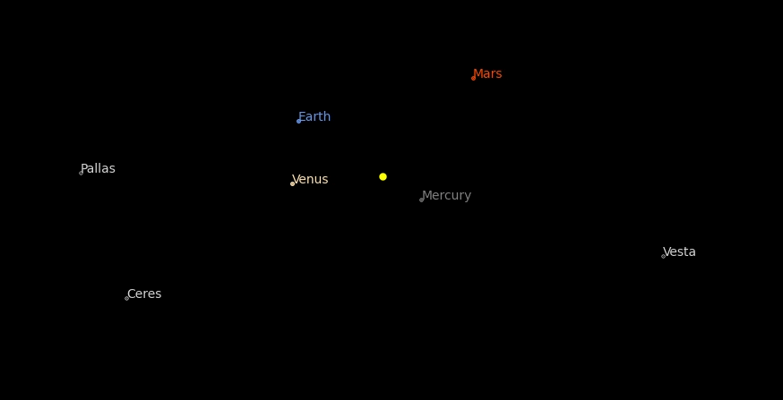

# N-body simulation

## Problem

Every point mass attracts every single other point mass by a force acting along the line intersecting both points. The force is proportional to the product of the two masses and inversely proportional to the square of the distance between them:

$$ F = G \cdot \frac{m_1 \cdot m_2}{r^2}, $$

where $F$ is the force between the masses, $G$ is the gravitational constant, $m_1$ and $m_2$ are the masses of object 1 and 2, and $r$ is the distance between the two objects. 

To account for the direction of the gravitational force this formula can be written as a vector equation:

$$ F_{21} = -G \cdot \frac{m_1 \cdot m_2}{|r_{21}|^2} \cdot \hat{r}_{21}, $$

where $F_{21}$ is the force applied on object 2 exerted by object 1, $G$ is the gravitational constant, $m_1$ and $m_2$ are the masses of object 1 and 2, $|r_{21}|$ is the distance between the two objects, and $\hat{r}_{21}$ is the unit vector from object 1 to object 2.

While the [two-body problem](https://en.wikipedia.org/wiki/Two-body_problem) and *restricted* [three-body problem](https://en.wikipedia.org/wiki/Three-body_problem) can be solved analytically, the general **n-body problem** must be simulated using numerical methods. 

The most simple approach is the direct brute-force method where we nummerically integrate the equation of motion for each mass seperatly. It uses no approximations but has a complexity of $O(n^2)$ and therefore becomes explonentially slower with the number of particles.

Source: [Wikipedia](https://en.wikipedia.org/wiki/Newton's_law_of_universal_gravitation)

## How to

Install dependencies:
* Python v3.10.4
* Matplotlib v3.5.2
* Numpy v1.23.1

Run `main.py`
